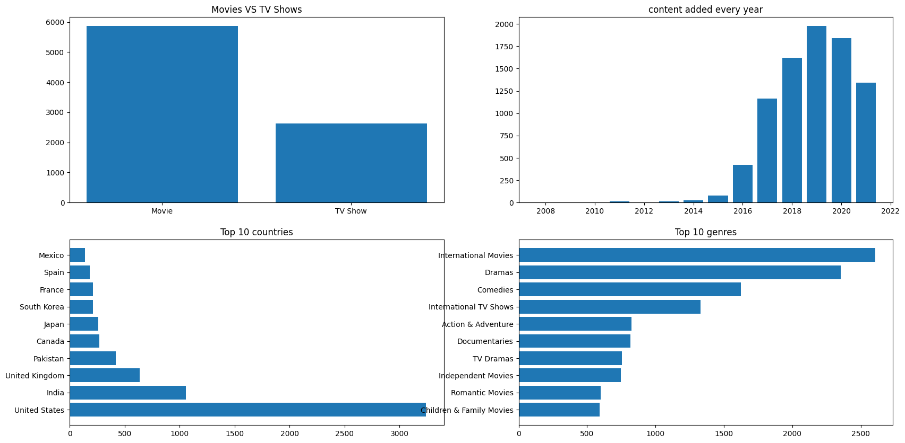

# Netflix_Shows_Analysis
This project performs Exploratory Data Analysis (EDA) on Netflix content to understand patterns in content distribution, growth, genres, and audience targeting.

## Dataset
- Source: Netflix dataset (Kaggle)
- Contains information about movies and TV shows including:
  - Title, Type, Country, Director, date_added, Release_year, Rating, Duration, Genre, Date Added
 
## Objectives
- Compare Movies vs TV Shows
- Analyze content growth over time
- Identify seasonal trends
- Find top producing countries
- Understand audience ratings
- Discover popular genres

## Key Insights
- Movies dominate (~70%), but TV shows are growing faster
- Content additions peaked around 2019
- More content is added in July and December
- USA leads content production, followed by India
- Most content targets adults (TV-MA)
- Popular genres include Drama, Comedy, and International content

## Dashboard

